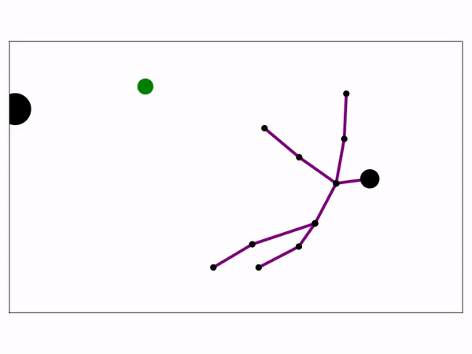

# Potentials.jl

Reviving the glories of Artificial Potential Fields for fast, reactive motion control.

## Features
* Implements goal-receding attractor potentials to escape local minima imposed by obstacle repulsion fields
* Implements a velocity-based control scheme for more stable whole-body robot motions

## Installation
1. Open your Julia REPL by typing  `julia` in your terminal.
2. Press `]` on your keyboard to enter the package manager
3. Enter command `add https://github.com/adubredu/Potentials.jl` and press 
`Enter` on your keyboard to install this package.
4. Press the `Backspace` key on your keyboard to return to the REPL

## Usage
See the [prototypes](prototypes) folder for usage examples.